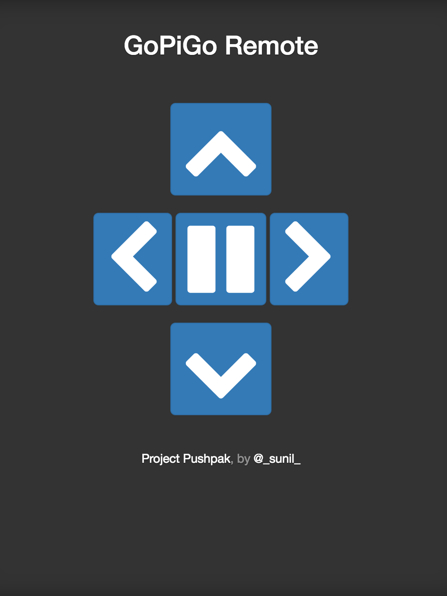

# Pushpak
Pushpak is a web application which implements remote control functionality for
GoPiGo robot car. This web application runs on Pi which is attached to the
GoPiGo robot kit and can be accessed in any browser running on your phone or
Laptop.

The GoPiGo is a delightful and complete robot for the Raspberry Pi that turns your Pi into a fully operating robot.  GoPiGo is a mobile robotic platform for the Raspberry Pi developed by [Dexter Industries.](http://www.dexterindustries.com/GoPiGo)

Here is a screenshot of the remote control web application.

## Getting Started

### Running remote control web app with pre-built server binaries
Assuming you are on Raspberry Pi. Clone this repository using following command
and then run the server binary using following commands:

`git clone https://github.com/droot/pushpak`
`cd pushpak`
`./bin/server`

Now you should have server UP and running. Open your browser and access
http://<ip-addr-of-pi>:8070

Use Up/Down/Left/Right/Stop arrow to control your GoPiGo.

## Credits
Special Thanks to Dexter Industries for providing [@GoPiGo kit](http://www.dexterindustries.com/shop/gopigo-starter-kit-2/) for the development.

## Need help ?
 * Issues: https://github.com/droot/pushpak/issues
 * twitter: [@droot](https://twitter.com/_sunil_)
